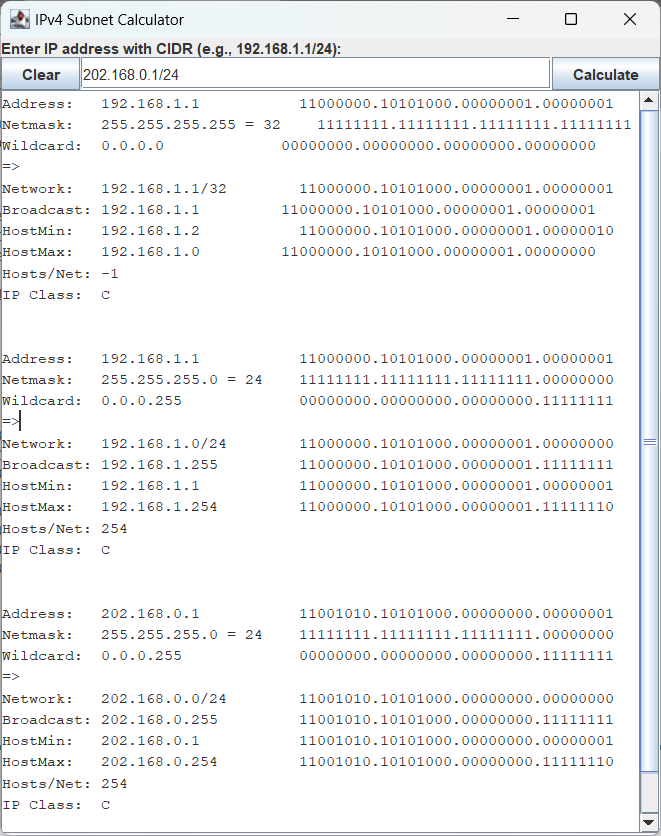

# IPv4 Subnet Calculator

The IPv4 Subnet Calculator is a Java application that allows users to calculate subnet details based on an IPv4 address and subnet mask provided in CIDR notation. The application features a graphical user interface (GUI) for ease of use and provides essential subnet information, including the network address, broadcast address, number of hosts, and IP class.

## Features

- **IPv4 Address Validation**: Ensures that the provided IP address is valid.
- **Subnet Mask Validation**: Ensures that the provided subnet mask is valid.
- **Subnet Calculation**: Calculates network address, broadcast address, first and last host addresses, and the number of usable hosts per subnet.
- **IP Class Identification**: Determines and displays the IP class (A, B, C, D, E).
- **Graphical User Interface (GUI)**: Built using Swing for a user-friendly interface.
- **CIDR Notation Support**: Accepts input in CIDR notation (e.g., `192.168.1.1/24`).

## Usage
1. Launch the application.
2. Enter an IPv4 address with CIDR notation (e.g., `192.168.1.1/24`).
3. Click the `Calculate` button to display subnet details.
4. Click the `Clear` button to reset the input and results.

